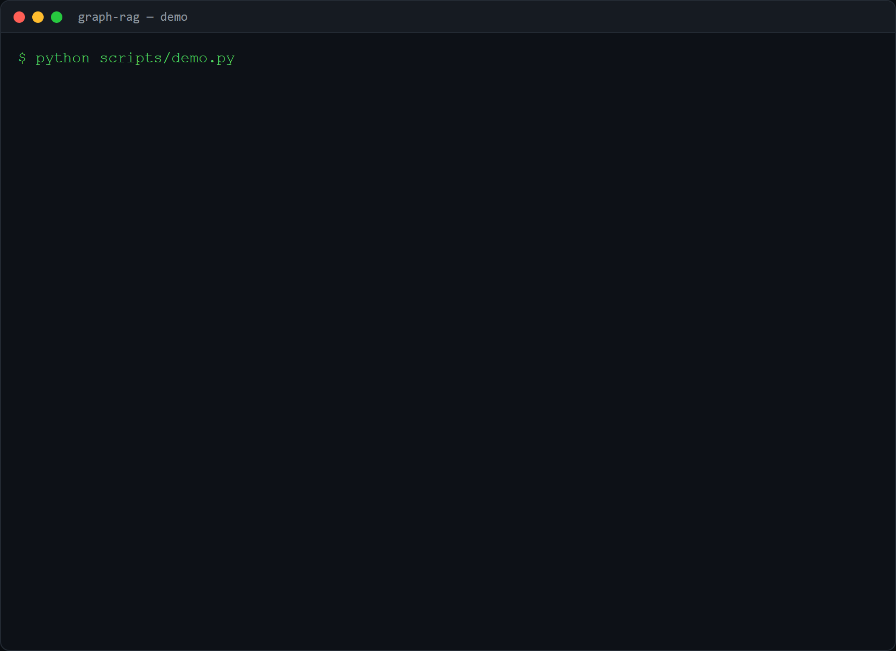

# graph-rag

Build a knowledge graph from text and answer **multi-hop** questions by walking
it, the kind of question flat vector RAG misses.

## Demo



The demo (`scripts/demo.py`) runs on the tiny text corpus in [`corpus/`](corpus):
three plain-English files with sentences like *"Ada founded Acme. Acme acquired
Beta. Beta built Orion."* It extracts triples with the OpenAI `LLMExtractor` when
`OPENAI_API_KEY` is set, otherwise the offline rule-based extractor, then (1)
builds the graph and prints the triple count and the most central entities by
PageRank, (2) answers the multi-hop question *"How is Ada related to Orion?"* by
walking `Ada -> Acme -> Beta -> Orion`, (3) shows why flat vector RAG misses it
by scanning the corpus (no single document names both Ada and Orion, so a chunk
retriever has no passage that links them), and (4) runs a neighborhood query
around `Beta`.

## Why a graph

Vector RAG retrieves chunks by similarity, so it answers well when the facts sit
in one passage. It struggles when the answer spans a chain: if Ada founded Acme,
Acme acquired Beta, and Beta built Orion, then **no single sentence mentions Ada
and Orion together**, so chunk similarity never connects them.

A graph makes the links explicit. Extract `(subject, relation, object)` triples,
store them as nodes and edges, and a question becomes a traversal:

```
How is Ada related to Orion?
-> Ada -[founded]-> Acme -[acquired]-> Beta -[built]-> Orion
```

## How it works

1. **Extract triples.** Real, messy text uses the `LLMExtractor` (OpenAI, the
   `openai` extra), which asks the model for JSON triples. A rule-based extractor
   (proper-noun entities + a known relation phrase) sits behind the same
   interface for offline, deterministic runs in tests and CI.
2. **Build the graph** with `networkx` (entities are nodes, relations are edges).
3. **Retrieve.** Link the question to entities, then either find the shortest
   connecting path (multi-hop) or expand the k-hop neighborhood around a seed.

## Use it

```python
from graph_rag import GraphRAG

rag = GraphRAG()
rag.ingest_directory("corpus")

res = rag.search("How is Ada related to Orion?")
print(res.render())   # Ada -[founded]-> Acme -[acquired]-> Beta -[built]-> Orion

rag.connect("Ada", "Orion")      # the raw path steps
rag.central(3)                   # most central entities by PageRank
```

```bash
pip install -e .
python scripts/demo.py
```

Real text with an LLM extractor:

```bash
pip install -e ".[openai]"
cp .env.example .env        # set OPENAI_API_KEY
```
```python
from graph_rag import GraphRAG, LLMExtractor
rag = GraphRAG(extractor=LLMExtractor())
```

## Tests

```bash
pip install -e ".[dev]"
pytest
```

Covers extraction, the built graph, in-order entity linking, the multi-hop path
(Ada -> Acme -> Beta -> Orion), and the neighborhood query.

## Limitations and next steps

- The rule-based extractor only handles clean "Entity relation Entity" sentences
  and treats Title-Case tokens as entities; real text needs the LLM extractor.
- There is no entity resolution (coreference, aliases), so "Acme" and "Acme Inc"
  would be two nodes.
- Next: hybrid retrieval (vector search to pick seed nodes, then graph walk), and
  community summaries over the graph for global questions.

## License

MIT.
